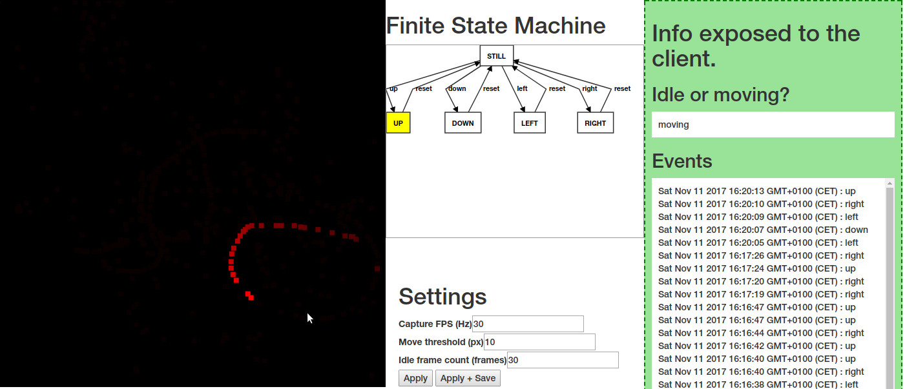

# Movdet (Movement Detection)



## Author
Yann Pellegrini

## Licence
CC BY SA v3

## Description
Check if detecting movements with the mouse can be done in an intuitive way, in order to transpose that mechanism to an Android app with marker detection using the camera.

Techs: JS ES6, d3, javascript-state-machine, browserify

## Compiling

`npm install`

```
browserify src/main.js -o dist/movdet.js
# or,
watchify -d src/main.js -o dist/movdet.js -v
```

# Demo

[https://yann-p.fr/movdet](https://yann-p.fr/movdet)
